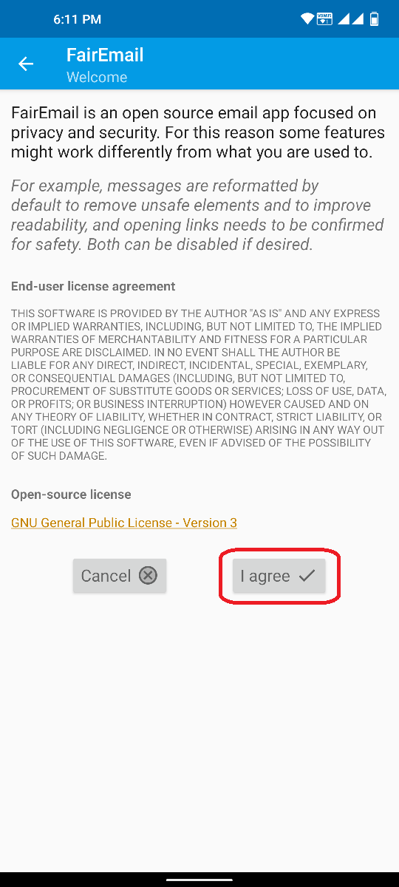
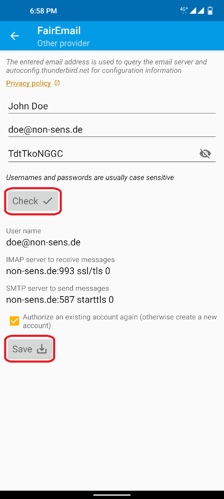
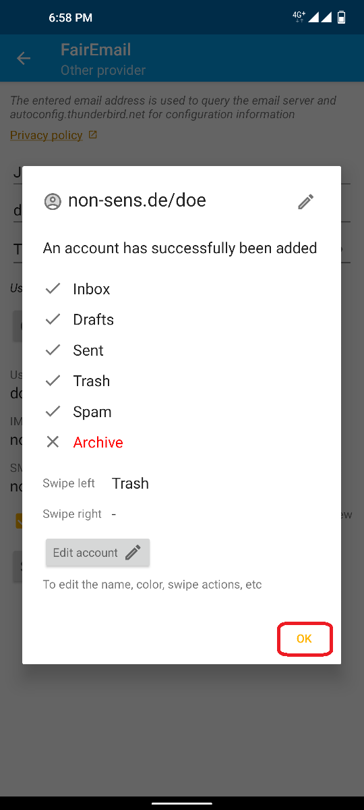
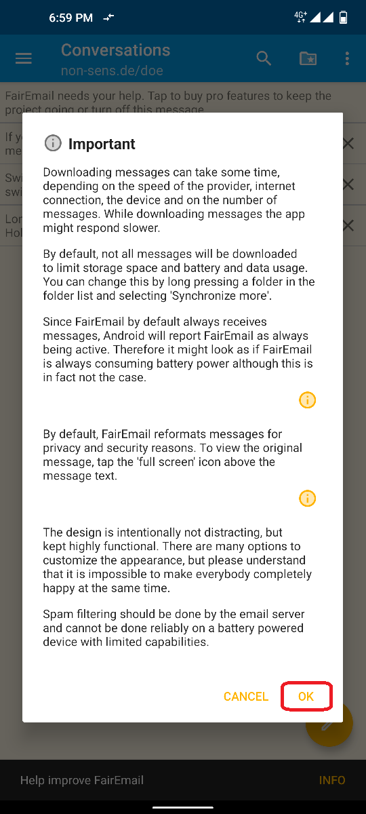
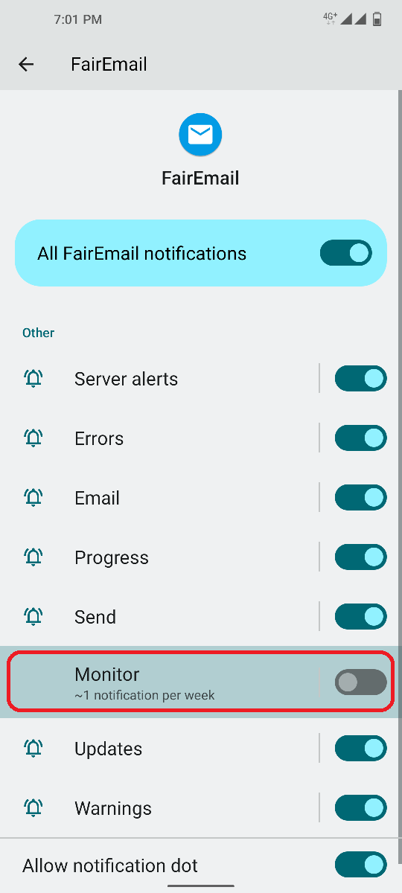

# First configuration

&#x1F30E; [Google Translate](https://translate.google.com/translate?sl=en&u=https%3A%2F%2Fgithub.com%2FM66B%2FFairEmail%2Fblob%2Fmaster%2Ftutorials%2FFIRST-CONFIG.md)

**NOTE:** If you have any troubles, check [this extensive FAQ](https://github.com/M66B/FairEmail/blob/master/FAQ.md).
You may also ask in [this XDA Forum thread](https://forum.xda-developers.com/t/app-5-0-fairemail-fully-featured-open-source-privacy-oriented-email-app.3824168/)
or via [this contact form](https://contact.faircode.eu/?product=fairemailsupport). Bad reviews won't help you or the developer, so please try asking in person first.

## 1. Accepting the license agreement

When you start the app for the first time, you need to accept the license agreement.

## 2. Starting the wizard

FairEmail has a setup wizard integrated. It will lead you through the process. Choose the wizard for the easiest configuration.
If your email provider is not listed, or if you want to authenticate using a password, choose "Other provider".

**NOTE:** OAuth only works for the Play Store and GitHub version. Third party builds (e.g. on F-Droid) do not support OAuth.

**NOTE:** Google OAuth only works for Google accounts added on your Android device. Also see [FAQ #111 Is OAuth supported?](https://github.com/M66B/FairEmail/blob/master/FAQ.md#user-content-faq111)

## 3. Fill in credentials

Fill in your screen name, your email address and your password. FairEmail will fetch the server settings automatically for most email providers.
If you want to check the password for typos, you can enable showing the entered password by clicking on the eye icon.
After you have entered everything, press the "check" button.

**NOTE:** This step requires working internet connection.

## 4. Setting up default folders

FairEmail will try to recognize the default folders for the inbox, sent messages, spam messages, drafts and archived messages.
Accept with "OK" if the settings look fine. Otherwise, you may also edit the settings.

## 5. Disable battery optimization

Below the wizard, there are two more options:

* Grant access to your contacts, if you want to use the contacts on your device (optional)
* Disable battery optimization (highly recommended to ensure the app works in the background)

**NOTE:** Even with battery optimization disabled, FairEmail won't drain your battery. The app usage will be high. But that does not mean high battery usage. See [FAQ #39 How can I reduce the battery usage of FairEmail?](https://github.com/M66B/FairEmail/blob/master/docs/FAQ-en-rGB.md#user-content-faq39) for more information.

## 6. (Unified) inbox

Once you press the back button, you'll enter your new inbox. At first, you will see a pop-up message with important information.
For your better understanding, there will be additional information you can dismiss by tapping on the "X".
Please read them as they will help you in understanding how the app works and how to get support.

That's it, your app is set up to work.

## Optional settings

FairEmail will already work with the configuration above. However, you may want to change some minor things.
As FairEmail comes with a lot of options, you can very likely adjust the app and its behavior to the way you personally would like it.
However, all of those options are optional. The app works well and is stable with the default options without requiring any adjustment by you.

If you still would like to change the settings, just take time looking around the available options. You can also search through available settings.
The most common three settings you might want to set on the first run are mentioned below.
Apart from that, there's also [this separate tutorial describing various settings / options](https://github.com/M66B/FairEmail/blob/master/tutorials/SETTINGS-OVERVIEW.md) in FairEmail.

### 1. Disable the permanent notification

The permanent notification is a necessary foreground service as many phones kill the app once there is nothing in the foreground anymore.
However, it is designed in a way that it has no toll on your battery. If the permanent notification banner annoys you, you can just turn the notification off.
To do so, press and hold on the notification and then click on the settings icon (gear symbol).
Now disable the slider for the "Monitor".

### 2. Changing start screen

By default you will see a unified inbox on your start screen, which will summarize the inboxes of all your mail accounts in FairEmail.
If you prefer to have a classic account view on start, maybe because you manage a greater number of email accounts with FairEmail,
you can do this as follows:

1. Open the menu by tapping the three dashes in the top left corner (hamburger menu)
2. Choose "Settings"
3. At the top bar, select the tab called "Display"
4. Go to the option "Show on start screen" and select an available option within the dropdown menu
5. Use the back key to get back to the start screen

### 3. Changing the theme

You can slightly change the way the app looks. To this end, FairEmail comes with multiple pre-installed themes.
You can switch themes like this:

1. Open the menu by tapping the three dashes in the top left corner (hamburger menu)
2. Choose "Settings"
3. At the top bar, select the tab called "Display"
4. Press the "Select theme" button
5. Select the theme of your choice and confirm

**NOTE:** Dynamic themes are not possible in Android.
See [FAQ #164 Can you add customizable themes?](https://github.com/M66B/FairEmail/blob/master/FAQ.md#user-content-faq164) for further details.

 

Thanks @[mkasimd](https://github.com/mkasimd/) for contributing this documentation.

